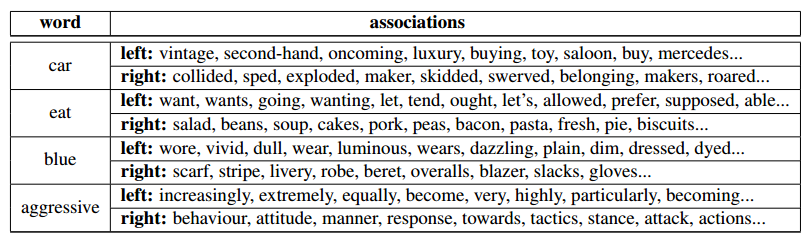

# Syntagmatic Word Embeddings (SPVec)

This repository contains a python implementation of the Syntagmatic Word Embedding model of Renjith
P Ravindran, Akshay Badola and K Narayana Murthy as described in their paper [Syntagmatic Word
Embeddings for Unsupervised Learning of Selectional
Preferences](http://aclanthology.org/2021.repl4nlp-1.22/).

Unlike the embedding models such as Word2vec and GloVe, that capture word similarity (paradigmatic
relations), syntagmatic embeddings capture word associations (syntagmatic relations).

Therefore, it can be used to measure the degree of selectional preference (association) between two words.
Selectional preferences of words tell how likely two words are to form a syntactic relation.  For
eg. 'black cat' is more likely than 'blue cat', or that 'eat dinner' is more likely than 'eat tree'.
Selectional preferences are usually learned from syntactically related word pairs in a parsed
corpus, but by reducing syntactic relations to directions, syntagmatic embeddings can do pretty well
simply with a plain corpus.

SPVec gives two embeddings per word, one of left context and other of right context.
If l_w is the left embedding of a word w and r_w the right embedding,
then the association between word v to the right of word u is given by cosine(r_u,l_v).



## About the Code

Our code is tested on python 3.7 and 3.8. They should run on 3.9 also.

The advised way to run any of the scripts is to use a `virtualenv`. You can run:

```
$ python -p python[ver] virtual [dir]
```

Where `ver` is the python version (one of 3.7, 3.8, 3.9) and `dir` is the directory in which to
create the env.

After that you can install the requirements with `pip install -r requirements.txt`

## Data and Model

For the preprocessed (min counted) corpus file (used in paper), you can obtain it from [here](https://drive.google.com/file/d/1fE5kSBHct3bnZE0_NOh3mxixZHdKmPGJ/view?usp=sharing)

Download trained embeddings file [here](https://drive.google.com/file/d/1CQ--9Shrls0kf6pdoza8dDBWNe1SLBd2/view?usp=sharing)

After that you can use:

```
$ python spvec.py [learn|eval|query] --help
```

to view help on individual commands.

## Evaluating the embeddings

To run the evaluation and see the results, you can run:

```
$ python spvec.py eval --model-file <path-to-embedding-file>
```

To query the model on specific words, you can run:

```
$ python spvec.py query --model-file <path-to-embedding-file>
```


## Learn the embeddings

```
$ python spvec.py learn --corpus-file <path-to-corpus-file>
```
